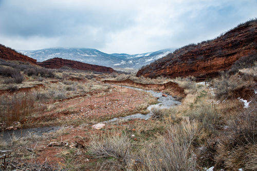

# Layer: Poudre Trails 

* [Trails and Water](#trails-and-water)
	+ [Flooding](#flooding)
* [Data Sources](#data-sources)
* [Map Creation Workflow](#map-creation-workflow)

---

The Poudre trails layer contains trails within the Poudre Basin.
**Currently only Fort Collins trails are included.  Additional layers will be added from other sources,
or a merged layer may be created.**

## Trails and Water

Trails are often located near water because streams and rivers have done the work to carve out transporation routes,
water supports interesting ecosystems near trails, and of course, water is needed for humans that use the trails.
The trails map illustrates opportunities to learn about water, as described in the following sections.

## Flooding ##

The [Red Mountain Open Space](https://www.larimer.org/naturalresources/parks/red-mountain) near the Wyoming Boarder
has trails through the Boxelder Creek drainage.
Flooding in the Boxelder Creek basin has caused loss of property and life in
in developed areas such as Fort Collins and surrounding communities,
resulting in establishment of the [Boxelder Stormwwater Authority](https://www.boxelderauthority.org/),
which collects fees in order to construct and manage stormwater infrastructure.
The potential for and impacts of flooding may not be obvious in downstream areas;
however, a hike in Red Mountain Open Space
points out the impacts of flooding in that area and potential of high flows to cause damage downstream.

**Ruby Wash** (image from [AllTrails](https://www.alltrails.com/parks/us/colorado/red-mountain-open-space))

## Data Sources

The following are data sources for this map:

| **Resource** | **Source** |
| -- | -- |
| Fort Collins trails. | [Multi-Use Trails](https://opendata.fcgov.com/dataset/Multiuse-Trail/3j2e-2d5c) map layer dataset from Fort Collins open data portal. |

## Workflow

The workflow to process the data can be found in the [GitHub repository](https://github.com/OpenWaterFoundation/owf-infomapper-poudre/tree/master/workflow/BasinEntities/Recreation-Trails).
